<div align="center">

# 🔧 Zongedo

### Mobile Mechanic Service Booking & Management System

A full-stack web application that powers a mobile mechanic business — enabling customers to book automotive services online and giving administrators complete control over bookings, customers, invoices, and service management.

[](https://nodejs.org/)
[](https://react.dev/)
[](https://expressjs.com/)
[](https://www.sqlite.org/)
[](https://tailwindcss.com/)

</div>

---

## 📖 Table of Contents

- [Introduction](#-introduction)
- [Features](#-features)
- [Screenshots](#-screenshots)
- [Tech Stack](#-tech-stack)
- [Getting Started](#-getting-started)
- [Environment Variables](#-environment-variables)
- [Project Structure](#-project-structure)
- [Technical Architecture](#-technical-architecture)
- [API Reference](#-api-reference)
- [Database Schema](#-database-schema)
- [Authentication](#-authentication)
- [Email Notifications](#-email-notifications)
- [Security](#-security)

---

## 🚗 Introduction

**Zongedo** is a comprehensive mobile mechanic service platform designed for automotive businesses that deliver repair and maintenance services directly to the customer's location — whether at home, the office, or roadside.

The platform solves two core problems:

1. **For customers**: Book automotive services online 24/7, choose from a catalogue of services or request diagnostics, schedule at a convenient time and location, and track the status of bookings in real-time using a reference number.

2. **For administrators**: Manage the entire business workflow from a centralized dashboard — handle incoming bookings, manage customer records and vehicle histories, generate professional invoices with tax calculations, track revenue and performance metrics, and send automated email notifications at each stage of the service lifecycle.

---

## ✨ Features

### Customer-Facing

| Feature | Description |
|---------|-------------|
| **Service Catalogue** | Browse available services organized by category (Engine, Brakes, Tires, Electrical, etc.) with pricing and estimated duration |
| **Multi-Step Booking Wizard** | 5-step guided form: choose booking type → select services → enter vehicle info → contact details → schedule & location |
| **Two Booking Types** | *Service Booking* (select specific services) or *Diagnostic Booking* (describe an issue, fixed $95 diagnostic fee) |
| **Real-Time Booking Tracking** | Track booking status using reference number and email — see a visual timeline from Pending → Confirmed → In Progress → Completed |
| **Booking Confirmation** | Instant confirmation page with reference number, booking summary, and email notification |
| **Invoice Visibility** | View associated invoice details directly from the tracking page |

### Admin Dashboard

| Feature | Description |
|---------|-------------|
| **Analytics Dashboard** | At-a-glance stats: total bookings, today's bookings, customer count, revenue, unpaid invoices. Revenue chart (last 7 days) and status distribution breakdown |
| **Booking Management** | Full CRUD with search, status filtering, date filtering, and pagination. Accept/deny pending bookings, assign mechanics, update status with automatic customer email notifications |
| **Customer Management** | Customer directory with search, inline contact editing, vehicle registry, complete booking history, and invoice summaries |
| **Service Management** | Services grouped by category with create, edit, and active/inactive toggling. Configurable pricing and duration |
| **Invoice System** | Generate invoices from bookings, add extra charges, set due dates, mark as paid. Professional printable invoice layout with HST (13%) tax calculation |
| **Email Notifications** | Automated emails for booking confirmations, status updates, and invoice delivery via SMTP |

---

## 📸 Screenshots

### Customer Pages

| Home Page | Book a Service |
|:---------:|:--------------:|
| 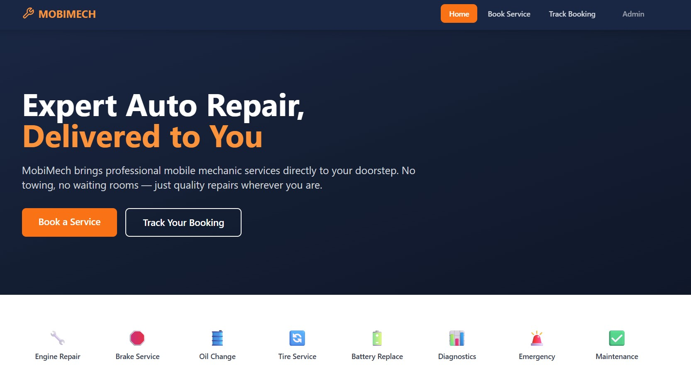 | 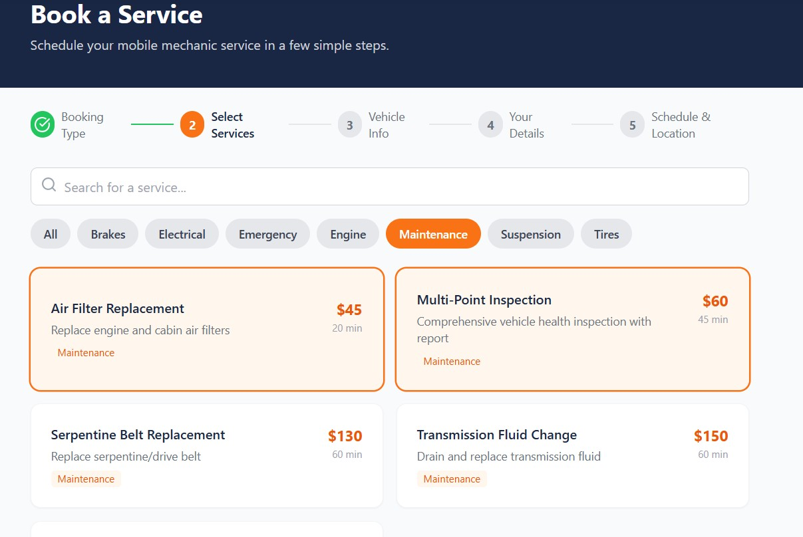 |

| Booking Confirmation | Track Booking |
|:--------------------:|:-------------:|
| 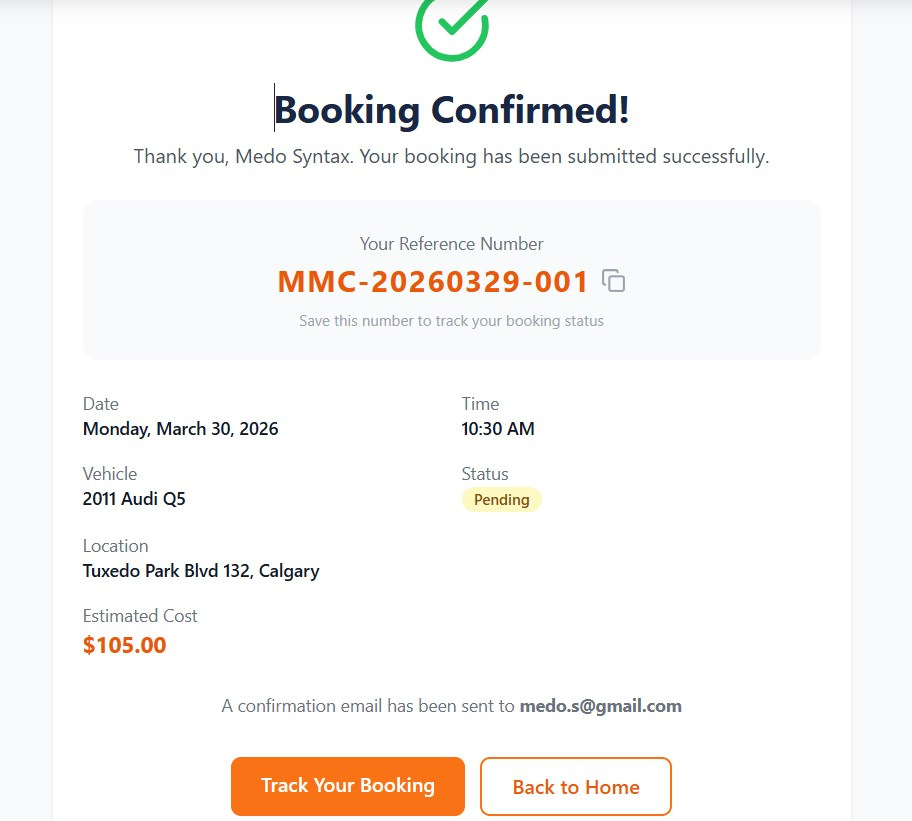 | 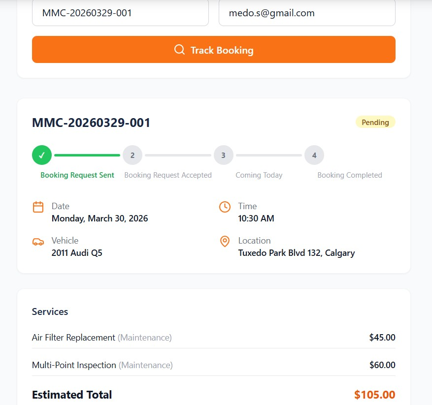 |

### Admin Panel

| Dashboard | Bookings Management |
|:---------:|:-------------------:|
| 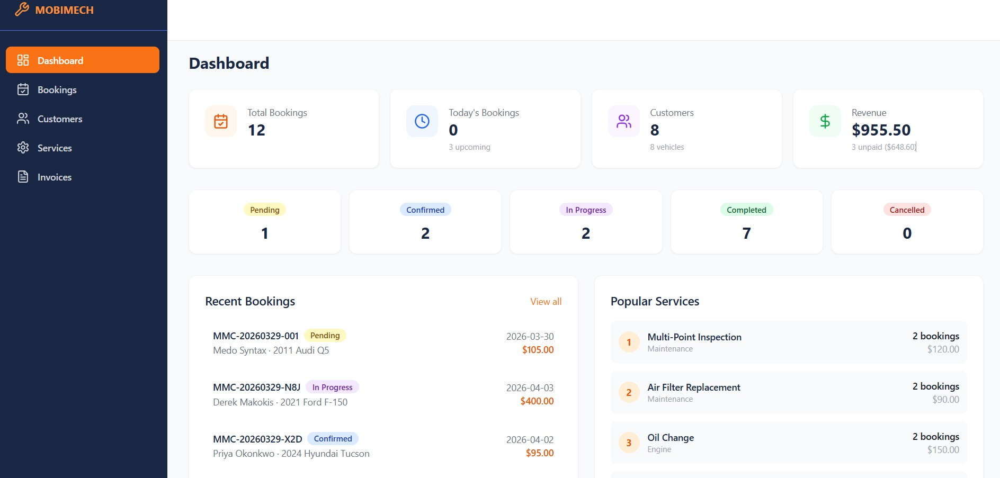 | 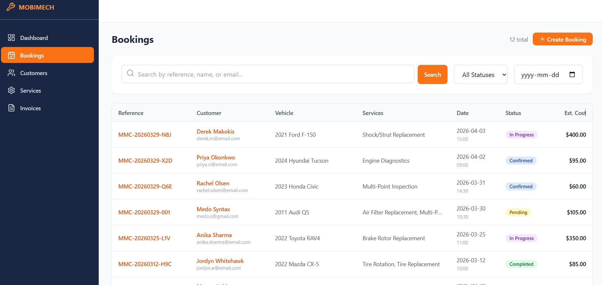 |

| Booking Detail | Customers |
|:--------------:|:---------:|
| 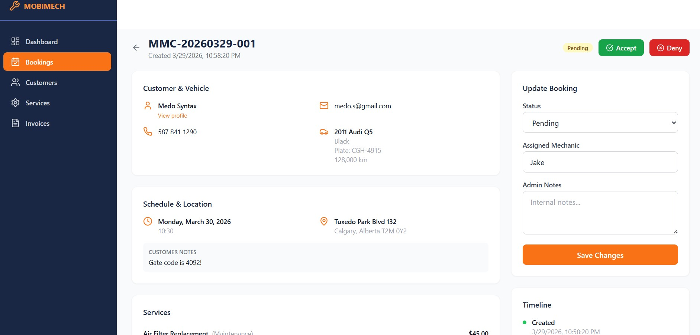 | 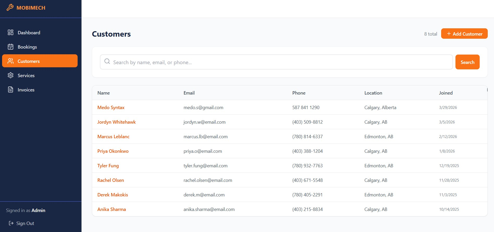 |

| Customer Detail | Services Management |
|:---------------:|:-------------------:|
| 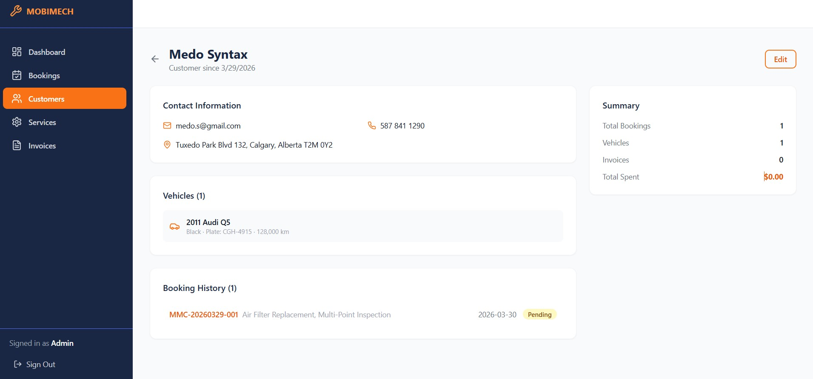 | 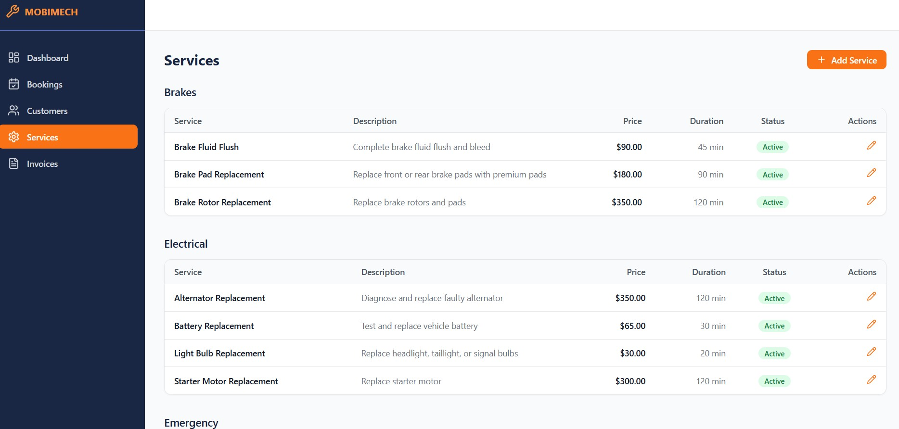 |

| Invoices | Invoice Detail |
|:--------:|:--------------:|
| 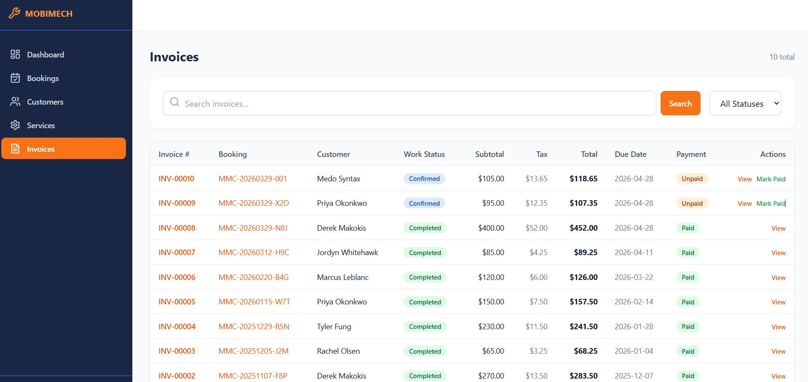 | 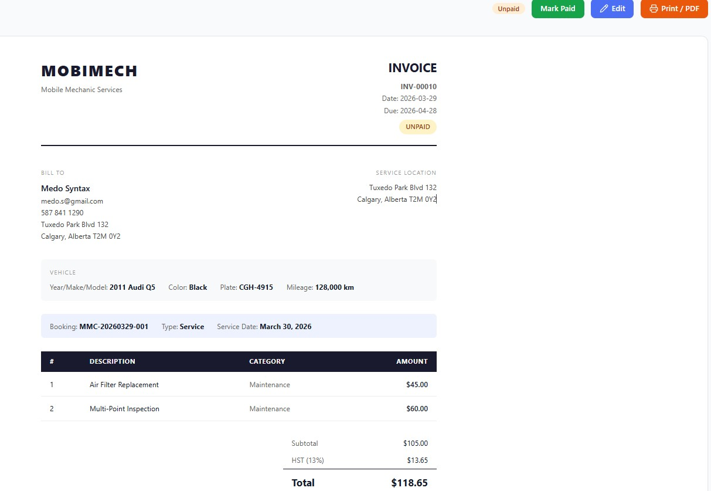 |

---

## 🛠 Tech Stack

### Frontend
- **React 18** — Component-based UI with hooks and context
- **React Router v6** — Client-side routing with protected routes
- **Tailwind CSS 3** — Utility-first styling with custom theme
- **Vite 6** — Fast build tool and dev server with HMR
- **Lucide React** — Icon library
- **date-fns** — Date formatting and manipulation
- **react-hot-toast** — Toast notification system

### Backend
- **Node.js** — JavaScript runtime
- **Express 4** — RESTful API framework
- **better-sqlite3** — Embedded SQLite database (synchronous, zero-config)
- **JSON Web Tokens** — Stateless authentication
- **bcryptjs** — Password hashing
- **Nodemailer** — SMTP email delivery
- **express-validator** — Request validation
- **Helmet** — HTTP security headers
- **express-rate-limit** — API rate limiting
- **CORS** — Cross-origin resource sharing

---

## 🚀 Getting Started

### Prerequisites

- **Node.js** 18 or higher
- **npm** 9 or higher

### Installation

```bash
# Clone the repository
git clone https://github.com/your-username/zongedo.git
cd zongedo

# Install all dependencies (root, server, and client)
npm run install:all
```

### Seed the Database

Populate the database with sample services, an admin account, and demo bookings:

```bash
npm run seed
```

Default admin credentials after seeding:
| Field | Value |
|-------|-------|
| Username | `admin` |
| Password | `admin123` |

### Run in Development

```bash
# Start both server and client concurrently
npm run dev
```

- **Client**: http://localhost:5173
- **Server**: http://localhost:3000

### Build for Production

```bash
# Build the client
npm run build

# Start the production server
npm start
```

---

## 🔐 Environment Variables

Create a `.env` file in the `server/` directory:

```env
# Server
PORT=3000
NODE_ENV=development

# Authentication
JWT_SECRET=your-secure-secret-key
ADMIN_USERNAME=admin
ADMIN_PASSWORD=admin123

# Email (optional — emails log to console when disabled)
EMAIL_ENABLED=true
SMTP_HOST=smtp.gmail.com
SMTP_PORT=587
SMTP_USER=your-email@gmail.com
SMTP_PASS=your-app-password
EMAIL_FROM=your-email@gmail.com
EMAIL_FROM_NAME=Zongedo Auto Services

# Client URL (for CORS)
CLIENT_URL=http://localhost:5173
```

---

## 📁 Project Structure

```
zongedo/
├── package.json                 # Root scripts (dev, build, start, seed)
├── client/                      # React frontend
│   ├── index.html
│   ├── vite.config.js
│   ├── tailwind.config.js
│   └── src/
│       ├── App.jsx              # Routes and layout
│       ├── api.js               # Axios-like fetch wrapper with auth headers
│       ├── main.jsx             # Entry point
│       ├── index.css            # Tailwind imports + custom styles
│       ├── context/
│       │   └── AuthContext.jsx  # JWT auth state management
│       ├── components/
│       │   ├── Navbar.jsx       # Public navigation bar
│       │   ├── Footer.jsx       # Site footer with contact info
│       │   ├── StatusBadge.jsx  # Color-coded status indicator
│       │   └── ProtectedRoute.jsx # Auth guard for admin routes
│       └── pages/
│           ├── Home.jsx                 # Landing page
│           ├── BookService.jsx          # Multi-step booking wizard
│           ├── BookingConfirmation.jsx  # Post-booking confirmation
│           ├── TrackBooking.jsx         # Public booking tracker
│           └── admin/
│               ├── Login.jsx            # Admin login
│               ├── AdminLayout.jsx      # Sidebar + content layout
│               ├── Dashboard.jsx        # Analytics overview
│               ├── Bookings.jsx         # Booking list & filters
│               ├── BookingDetail.jsx    # Single booking management
│               ├── Customers.jsx        # Customer directory
│               ├── CustomerDetail.jsx   # Customer profile & history
│               ├── Services.jsx         # Service catalogue management
│               ├── Invoices.jsx         # Invoice list & filters
│               └── InvoiceDetail.jsx    # Invoice view, edit & print
└── server/                      # Express backend
    ├── index.js                 # Server entry, middleware, route mounting
    ├── db.js                    # SQLite initialization & schema
    ├── email.js                 # Nodemailer config & email templates
    ├── seed.js                  # Database seeder
    ├── middleware/
    │   └── auth.js              # JWT verification middleware
    └── routes/
        ├── auth.js              # Login & session endpoints
        ├── bookings.js          # Booking CRUD + public tracking
        ├── customers.js         # Customer CRUD
        ├── dashboard.js         # Aggregated dashboard stats
        ├── invoices.js          # Invoice CRUD + payment
        ├── services.js          # Service catalogue CRUD
        └── vehicles.js          # Vehicle management
```

---

## 🏗 Technical Architecture

### System Overview

```
┌─────────────────────────────────────────────────────────┐
│                      CLIENT (React)                     │
│  Vite Dev Server :5173  ←──→  Production Static Build   │
│                                                         │
│  ┌─────────────┐  ┌──────────┐  ┌───────────────────┐  │
│  │ Public Pages │  │  Admin   │  │   Auth Context     │  │
│  │ Home/Book/   │  │  Panel   │  │   (JWT in          │  │
│  │ Track        │  │          │  │    localStorage)   │  │
│  └──────┬───────┘  └────┬─────┘  └───────────────────┘  │
│         │               │                                │
│         └───────┬───────┘                                │
│                 │  api.js (fetch wrapper)                 │
└─────────────────┼───────────────────────────────────────┘
                  │ HTTP / JSON
                  ▼
┌─────────────────────────────────────────────────────────┐
│                    SERVER (Express)                      │
│  Port :3000                                             │
│                                                         │
│  ┌──────────────────────────────────┐                   │
│  │          Middleware Stack         │                   │
│  │  Helmet → CORS → Rate Limit →    │                   │
│  │  JSON Parser → Routes            │                   │
│  └──────────────────────────────────┘                   │
│                                                         │
│  ┌───────────┐  ┌───────────┐  ┌──────────────┐        │
│  │   Routes   │  │   Auth    │  │   Email      │        │
│  │ /api/*     │  │ Middleware│  │  (Nodemailer) │        │
│  └─────┬──────┘  └───────────┘  └──────────────┘        │
│        │                                                 │
│        ▼                                                 │
│  ┌──────────────────────────────────┐                   │
│  │     SQLite (better-sqlite3)      │                   │
│  │     zongedo.db (file-based)      │                   │
│  └──────────────────────────────────┘                   │
└─────────────────────────────────────────────────────────┘
```

### Request Lifecycle

1. **Client** makes a fetch request via `api.js`, which automatically attaches the JWT `Authorization` header for authenticated requests.
2. **Express** receives the request and processes it through the middleware stack: `helmet` (security headers) → `cors` (origin validation) → `express-rate-limit` (throttling) → `express.json` (body parsing).
3. **Router** matches the endpoint. Protected routes pass through `auth.js` middleware, which verifies the JWT and attaches `req.user`.
4. **Route handler** validates input using `express-validator`, executes synchronous SQLite queries via `better-sqlite3`, and returns a JSON response.
5. **Side effects** (email notifications) are triggered asynchronously after the response is sent to avoid blocking.

### Booking Workflow

```
Customer submits booking form
        │
        ▼
┌─────────────────┐     ┌──────────────────┐     ┌─────────────────┐
│  Find/Create    │────▶│  Find/Create     │────▶│  Create Booking │
│  Customer       │     │  Vehicle         │     │  (status:       │
│  Record         │     │  Record          │     │   pending)      │
└─────────────────┘     └──────────────────┘     └────────┬────────┘
                                                          │
        ┌─────────────────────────────────────────────────┘
        │
        ▼
┌─────────────────┐     ┌──────────────────┐
│  Link Services  │────▶│  Send Email      │
│  to Booking     │     │  Confirmation    │
│  (booking_      │     │  + Return Ref #  │
│   services)     │     └──────────────────┘
└─────────────────┘

        Admin accepts booking
              │
              ▼
   ┌──────────────────┐     ┌──────────────────┐     ┌───────────────┐
   │  Status →        │────▶│  Status →        │────▶│  Generate     │
   │  confirmed       │     │  in-progress     │     │  Invoice      │
   │  (email sent)    │     │  (started_at     │     │               │
   └──────────────────┘     │   recorded)      │     └───────┬───────┘
                            └──────────────────┘             │
                                                             ▼
                                                    ┌───────────────┐
                                                    │  Mark Paid →  │
                                                    │  Status →     │
                                                    │  completed    │
                                                    └───────────────┘
```

### Reference Number Format

Booking references follow the pattern `ZNG-YYYYMMDD-XXX` where:
- `ZNG` — Zongedo prefix
- `YYYYMMDD` — Date of booking creation
- `XXX` — Random 3-character alphanumeric suffix

Invoice numbers follow the pattern `INV-XXXXX` (5-digit zero-padded sequential number).

---

## 📡 API Reference

All endpoints are prefixed with `/api`.

### Public Endpoints

| Method | Endpoint | Description |
|--------|----------|-------------|
| `GET` | `/api/services` | List active services. Optional query: `?category=` |
| `GET` | `/api/services/categories` | List all service categories |
| `GET` | `/api/services/:id` | Get single service details |
| `POST` | `/api/bookings` | Create a new booking |
| `GET` | `/api/bookings/track` | Track a booking: `?ref=ZNG-...&email=...` |

### Authentication

| Method | Endpoint | Description |
|--------|----------|-------------|
| `POST` | `/api/auth/login` | Admin login → returns JWT |
| `GET` | `/api/auth/me` | Get authenticated user info |

### Protected Endpoints (require `Authorization: Bearer <token>`)

#### Bookings
| Method | Endpoint | Description |
|--------|----------|-------------|
| `GET` | `/api/bookings` | List bookings with search, filter, pagination |
| `GET` | `/api/bookings/:id` | Full booking details with services and timeline |
| `PUT` | `/api/bookings/:id` | Update status, mechanic, notes, cost |

#### Customers
| Method | Endpoint | Description |
|--------|----------|-------------|
| `GET` | `/api/customers` | List customers with search and pagination |
| `GET` | `/api/customers/:id` | Customer detail with vehicles, bookings, invoices |
| `POST` | `/api/customers` | Create new customer |
| `PUT` | `/api/customers/:id` | Update customer information |

#### Services (Admin)
| Method | Endpoint | Description |
|--------|----------|-------------|
| `GET` | `/api/services/all` | List all services including inactive |
| `POST` | `/api/services` | Create a new service |
| `PUT` | `/api/services/:id` | Update service details |
| `DELETE` | `/api/services/:id` | Deactivate a service |

#### Invoices
| Method | Endpoint | Description |
|--------|----------|-------------|
| `GET` | `/api/invoices` | List invoices with status filter and search |
| `GET` | `/api/invoices/:id` | Full invoice with line items and extra charges |
| `POST` | `/api/invoices` | Generate invoice for a booking |
| `PUT` | `/api/invoices/:id` | Update invoice (notes, extra charges, due date, status) |

#### Vehicles
| Method | Endpoint | Description |
|--------|----------|-------------|
| `GET` | `/api/vehicles` | List vehicles. Optional: `?customer_id=` |
| `POST` | `/api/vehicles` | Create a vehicle record |
| `PUT` | `/api/vehicles/:id` | Update vehicle details |

#### Dashboard
| Method | Endpoint | Description |
|--------|----------|-------------|
| `GET` | `/api/dashboard/stats` | Aggregated stats, charts, popular services |

---

## 🗄 Database Schema

The application uses **SQLite** via `better-sqlite3` with the following relational schema:

### Entity Relationship

```
admin_users
    │
    ╰── (manages system)

customers ─────────< vehicles
    │                    │
    │                    │
    ├───────────< bookings >──────────< booking_services >────── services
    │                │
    │                │
    ├───────< invoices
    │                │
    │                │
    ╰───────< notifications
                     │
                     ╰── (linked to bookings)
```

### Tables

#### `admin_users`
| Column | Type | Constraints |
|--------|------|-------------|
| `id` | INTEGER | PRIMARY KEY, AUTOINCREMENT |
| `username` | TEXT | UNIQUE, NOT NULL |
| `password_hash` | TEXT | NOT NULL (bcrypt) |
| `name` | TEXT | |
| `email` | TEXT | |
| `role` | TEXT | DEFAULT `'admin'` |
| `created_at` | DATETIME | DEFAULT CURRENT_TIMESTAMP |

#### `customers`
| Column | Type | Constraints |
|--------|------|-------------|
| `id` | INTEGER | PRIMARY KEY, AUTOINCREMENT |
| `name` | TEXT | NOT NULL |
| `email` | TEXT | NOT NULL |
| `phone` | TEXT | |
| `address` | TEXT | |
| `city` | TEXT | |
| `province` | TEXT | |
| `postal_code` | TEXT | |
| `notes` | TEXT | |
| `created_at` | DATETIME | DEFAULT CURRENT_TIMESTAMP |
| `updated_at` | DATETIME | DEFAULT CURRENT_TIMESTAMP |

#### `vehicles`
| Column | Type | Constraints |
|--------|------|-------------|
| `id` | INTEGER | PRIMARY KEY, AUTOINCREMENT |
| `customer_id` | INTEGER | FK → `customers.id` |
| `make` | TEXT | NOT NULL |
| `model` | TEXT | NOT NULL |
| `year` | INTEGER | |
| `vin` | TEXT | |
| `license_plate` | TEXT | |
| `color` | TEXT | |
| `mileage` | INTEGER | |
| `notes` | TEXT | |
| `created_at` | DATETIME | DEFAULT CURRENT_TIMESTAMP |

#### `services`
| Column | Type | Constraints |
|--------|------|-------------|
| `id` | INTEGER | PRIMARY KEY, AUTOINCREMENT |
| `name` | TEXT | NOT NULL |
| `description` | TEXT | |
| `category` | TEXT | NOT NULL |
| `base_price` | REAL | NOT NULL |
| `duration_minutes` | INTEGER | |
| `active` | INTEGER | DEFAULT `1` |
| `created_at` | DATETIME | DEFAULT CURRENT_TIMESTAMP |

#### `bookings`
| Column | Type | Constraints |
|--------|------|-------------|
| `id` | INTEGER | PRIMARY KEY, AUTOINCREMENT |
| `reference_number` | TEXT | UNIQUE, NOT NULL |
| `customer_id` | INTEGER | FK → `customers.id` |
| `vehicle_id` | INTEGER | FK → `vehicles.id` |
| `status` | TEXT | DEFAULT `'pending'` |
| `scheduled_date` | TEXT | NOT NULL |
| `scheduled_time` | TEXT | |
| `location_address` | TEXT | |
| `location_city` | TEXT | |
| `location_province` | TEXT | |
| `location_postal_code` | TEXT | |
| `booking_type` | TEXT | DEFAULT `'service'` |
| `diagnostic_notes` | TEXT | |
| `notes` | TEXT | |
| `admin_notes` | TEXT | |
| `estimated_cost` | REAL | |
| `assigned_mechanic` | TEXT | |
| `started_at` | DATETIME | |
| `completed_at` | DATETIME | |
| `created_at` | DATETIME | DEFAULT CURRENT_TIMESTAMP |
| `updated_at` | DATETIME | DEFAULT CURRENT_TIMESTAMP |

#### `booking_services`
| Column | Type | Constraints |
|--------|------|-------------|
| `id` | INTEGER | PRIMARY KEY, AUTOINCREMENT |
| `booking_id` | INTEGER | FK → `bookings.id` |
| `service_id` | INTEGER | FK → `services.id` |
| `price` | REAL | NOT NULL |
| `notes` | TEXT | |

#### `invoices`
| Column | Type | Constraints |
|--------|------|-------------|
| `id` | INTEGER | PRIMARY KEY, AUTOINCREMENT |
| `invoice_number` | TEXT | UNIQUE, NOT NULL |
| `booking_id` | INTEGER | FK → `bookings.id` |
| `customer_id` | INTEGER | FK → `customers.id` |
| `subtotal` | REAL | NOT NULL |
| `tax_rate` | REAL | DEFAULT `0.13` |
| `tax_amount` | REAL | NOT NULL |
| `total` | REAL | NOT NULL |
| `status` | TEXT | DEFAULT `'unpaid'` |
| `notes` | TEXT | |
| `extra_charges` | TEXT | JSON array |
| `due_date` | TEXT | |
| `paid_date` | TEXT | |
| `created_at` | DATETIME | DEFAULT CURRENT_TIMESTAMP |

#### `notifications`
| Column | Type | Constraints |
|--------|------|-------------|
| `id` | INTEGER | PRIMARY KEY, AUTOINCREMENT |
| `booking_id` | INTEGER | FK → `bookings.id` |
| `customer_id` | INTEGER | FK → `customers.id` |
| `type` | TEXT | NOT NULL |
| `subject` | TEXT | |
| `body` | TEXT | |
| `status` | TEXT | DEFAULT `'sent'` |
| `created_at` | DATETIME | DEFAULT CURRENT_TIMESTAMP |

### Indexes

| Index | Table | Column(s) | Purpose |
|-------|-------|-----------|---------|
| `idx_bookings_reference` | bookings | reference_number | Fast reference lookup |
| `idx_bookings_status` | bookings | status | Status filtering |
| `idx_bookings_date` | bookings | scheduled_date | Date queries |
| `idx_bookings_customer` | bookings | customer_id | Customer's bookings |
| `idx_vehicles_customer` | vehicles | customer_id | Customer's vehicles |
| `idx_invoices_booking` | invoices | booking_id | Booking's invoice |
| `idx_invoices_customer` | invoices | customer_id | Customer's invoices |
| `idx_notifications_booking` | notifications | booking_id | Booking notifications |

---

## 🔑 Authentication

### Flow

```
Admin enters credentials
        │
        ▼
POST /api/auth/login
        │
        ▼
Server validates credentials (bcrypt.compare)
        │
        ▼
JWT generated (24h expiry)
  payload: { id, username, role, name }
        │
        ▼
Token stored in localStorage
  zongedo_token  → JWT string
  zongedo_user   → user object
        │
        ▼
All subsequent API calls include:
  Authorization: Bearer <token>
        │
        ▼
auth.js middleware verifies token
  → attaches req.user
  → or returns 401
```

- **Algorithm**: HS256 (HMAC-SHA256)
- **Expiration**: 24 hours
- **Storage**: `localStorage` (`zongedo_token`)
- **Client guard**: `ProtectedRoute` component checks `AuthContext` and redirects to `/admin/login` if unauthenticated

---

## 📧 Email Notifications

The system sends transactional emails via **Nodemailer** over SMTP. When `EMAIL_ENABLED` is not set to `true`, emails are logged to the server console instead of being sent — useful for development.

### Notification Types

| Type | Trigger | Content |
|------|---------|---------|
| **Booking Confirmation** | Customer submits a booking | Reference number, scheduled date/time, vehicle info, service list, estimated total |
| **Status Update** | Admin changes booking status | Updated status, booking reference, custom message per status |
| **Invoice** | Admin generates an invoice | Invoice number, itemized service breakdown, subtotal, HST, total, due date |

All sent emails are recorded in the `notifications` table with type, subject, body, and delivery status.

---

## 🛡 Security

| Layer | Implementation |
|-------|---------------|
| **HTTP Headers** | `helmet` sets strict security headers (CSP, X-Frame-Options, HSTS, etc.) |
| **Rate Limiting** | `express-rate-limit` throttles API requests to prevent abuse |
| **CORS** | Restricted to the configured `CLIENT_URL` origin |
| **Password Hashing** | `bcryptjs` with salted hashes for admin passwords |
| **JWT Authentication** | Stateless token-based auth with 24-hour expiration |
| **Input Validation** | `express-validator` sanitizes and validates all incoming request data |
| **SQL Injection Prevention** | `better-sqlite3` parameterized prepared statements for all queries |
| **Soft Deletes** | Services are deactivated (not deleted) to preserve booking history |

---

<div align="center">

**Built with precision for mobile mechanic businesses.**

</div>

